# Claude-Context-Test

Testando 2 plugins para redução de uso de token
Plugin 1: https://github.com/mksglu/context-mode
Plugin 2: 

## Projetos
- Serão utilizados, na medida do possível, os mesmo prompts em todos os projetos
- permiti ao claude code executar comandos locais.
- Será feito para cada prompt uma execução em modo planejamento e posterior execução
- Modelo: Sonnet 4.6 em esforço médio

### Vanilla
Base de comparação sem utilizar nenhum plugin

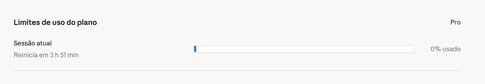
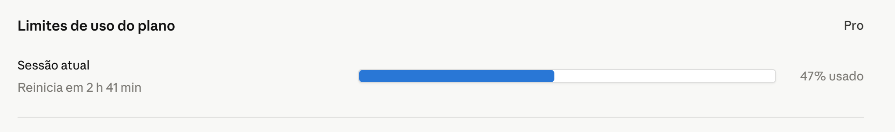

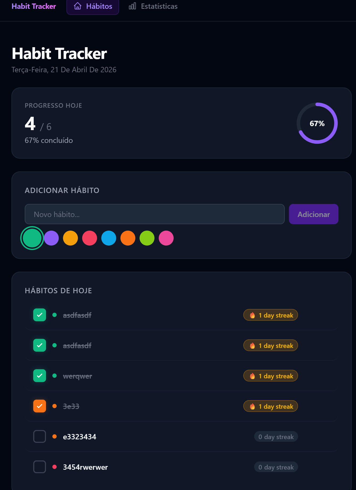
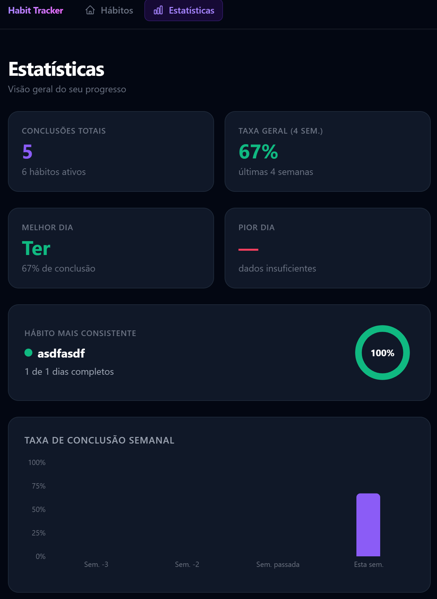

- Notas:
  - 1 erro corrigido no prompt 2
  - /init executado em plan mode
  - sem mais problemas ou correções de erros

### context-mode
Utilizando o Plugin 1

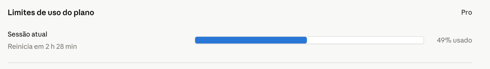
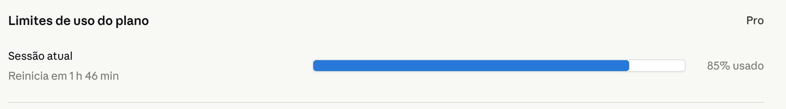

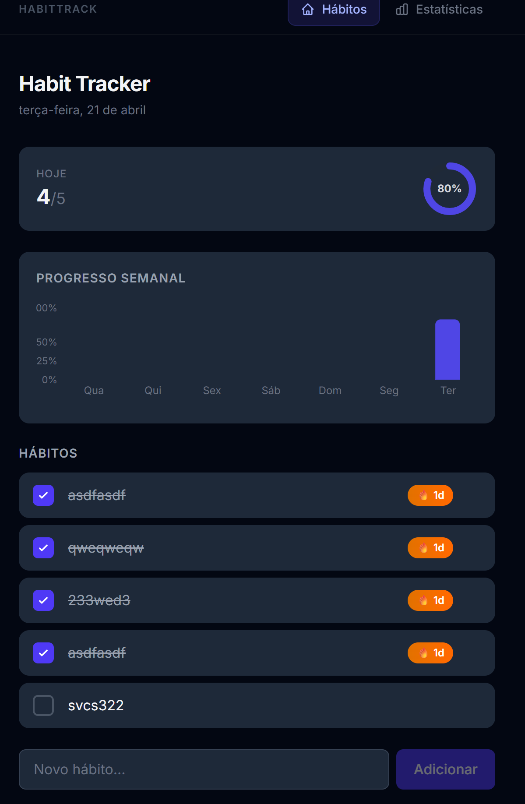
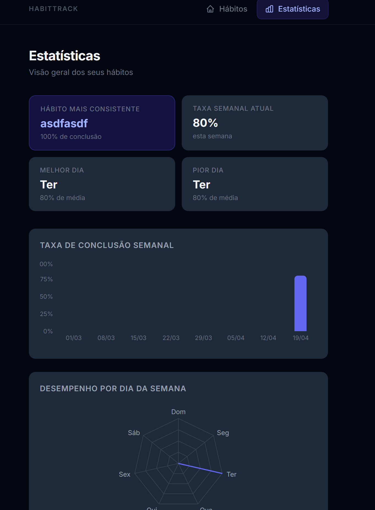

- Notas:
  - o design criado foi diferente, provavelment devido a falta de requisitos mais claros.
  - ctx stats prompt 1: 22,1% de redução
  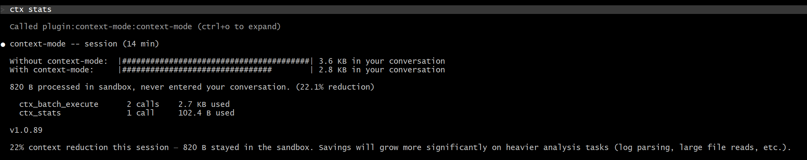
  - por erro meu o prompt 2 foi executado sem a etapa de planejamento, mas gerado sem erros
  - ctx stats prompt 2: 19,9% de redução
  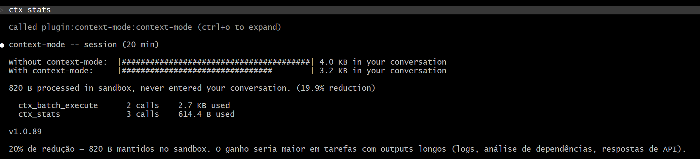
  - /init executado em plan mode
  - ctx stats prompt 3: 51,3% de redução
  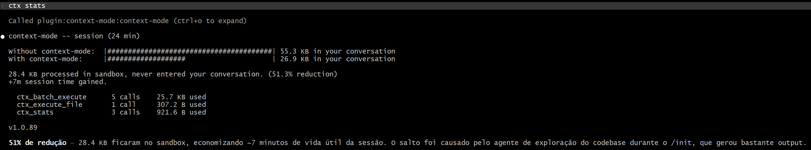
  - ctx stats prompt 4: 50,8% de redução
  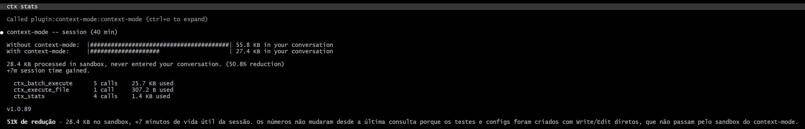
  - novamente por erro meu o prompt 5 foi executado sem a etapa de planejamento, mas gerado sem erros
  - ctx stats prompt 5: 50,4% de redução
  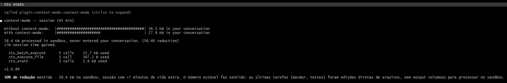

- Conclusão:
  - A princípio parece ter reduzido o consumo de tokens, apesar de mão ter executado o planejamento em dois prompts
  

## Prompts

### Prompt 1

Crie um dashboard de hábitos (habit tracker) utilizando Next js com as seguintes funcionalidades:
- Lista de hábitos com checkbox para marcar como feito no dia
- Streak counter (quantos dias seguidos)
- Gráfico simples de progresso semanal
- Possibilidade de adicionar e remover hábitos
- Design moderno e clean com dark moderno
- Use a localStorage para persistência por enquanto

### Prompt 2

Crie uma página /stats com estatísticas dos hábitos:
- Hábito mais consistente
- Taxa de conclusão por semanal
- Melhor e pior dia da semanal
- Use o Recharts para os gráficos

### Prompt 3

/init

### Prompt 4

Crie testes com Vitest para os componentes principais?
- Testar adicionar/remover hábitos
- Testar marcar Hábito como feito
- Testar cálculo de streak

### Prompt 5

Crie um componente Navbar.tsx com navegação entre as páginas do projeto:
- Link para Home (/) - ícone de casa + "Hábitos"
- Link para Stats (/stats) - ícone de gráfico + "Estatísticas"
- Navbar fixa no topo, estilo glassmorphims combinado com design atual
- Highlight no link da página ativa
- Adicione a navbar no layout.tsx para aparecer em todas as páginas
